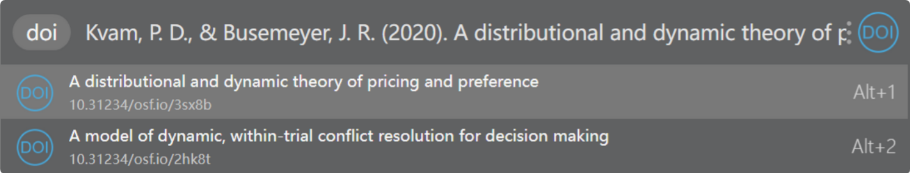

# txt2bib

This is a utools plugin, which transform reference text to dois. And the main function based on Crossref API.

## how to use it?
Downloading the .upx file, and installing it on utools by clicking middle button on it.

Typing the *keywords* "doi" or "getdoi" in the utools, and paste your reference, you could get the reference title and doi, and you could automatically get the dois in your clipboard which is convenient to be imported into zotero.

## For development

This plugin using JavaScript package axios to call on the API from Crossref.
In the utools, you could adapt it by utools (development tools)[http://www.u.tools/docs/developer/welcome.html]. 
And for using it independantly, you could loading the `request.js` module and call on the function `requests()`. There is just one argment which is reference text. And this function will return a promise class consist of a array object. 

If you face any problem, please leaving issues on github.

# todo
- [x] keys match
- [x] auto detect the clipboard
- [x] support super panel